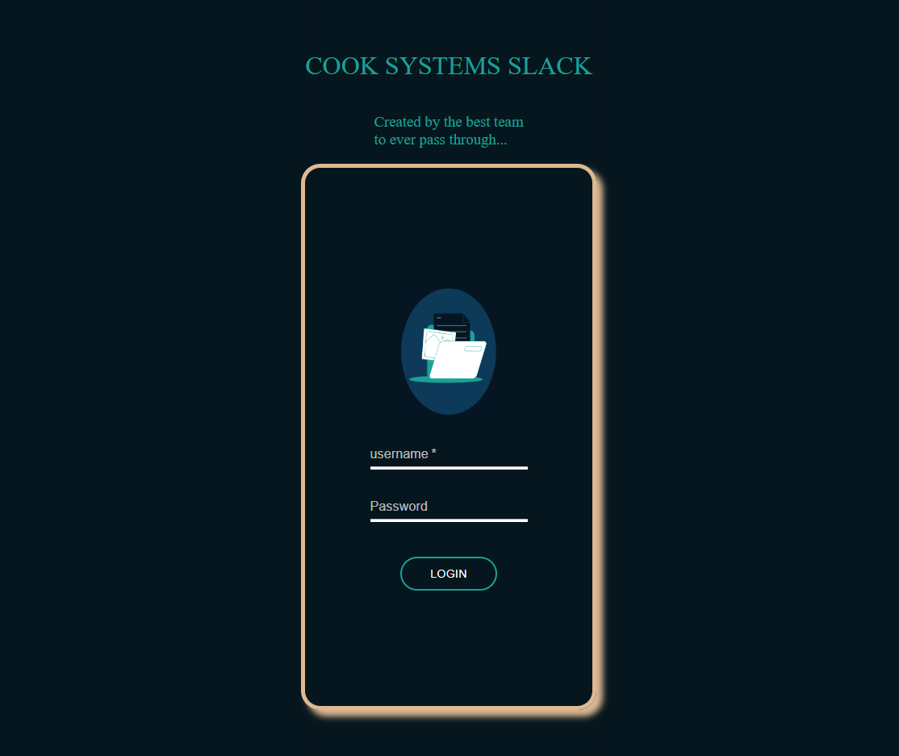

# SlackStack
## Description
Keep all your workers in touch with the company and keep all your projects organized in one location through our company communications app! Sign into your company and review teams, users, projects, and announcements, all in one location!

## Table of Contents
* [Usage](#usage)
* [Collaborators](#collaborators)
* [Installation](#installation)
* [Tests](#tests)
* [Badges](#badges)
* [Queries](#any-questions)

## Collaborators:
[Prima Jenkins](@PrimsCode), [Caleb Dickson](@tacDev-io), [Ricky Board](@rboard321), [Harold Garner](@MugenZeta), [Steven Vallarsa](@StevenVallarsa), and [Jordan Adkins](@JCAdkins)

## Usage
Sign in as an admin or a worker, and see the announcements for your company, your teams, and the projects in progress. If you are an admin, enjoy the added benefits of creating announcements that will immediately go company-wide, setting up new projects, and initializing teams to whom you can assign those projects. You can also create/edit/update all the users in the site with the admin privileges!

## Installation
Getting the full application up and running is still in the works. You can run locally by downloading to your machine right now, but the functionality to set up a new user is not yet in place. Stay tuned!

## Teaser:

 
## Tests
This project was tested using Postman and J-Unit.

### Badges

### Any Questions?
Contact [Team Awesome](https://github.com/sarahwylie) on GitHub

© 2022
